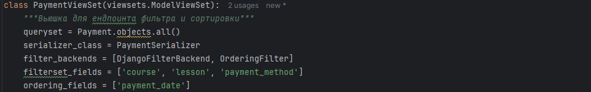

# ⏰ Habit Tracker

# 🔖 Описание проекта:

Данный проект является трекером привычек по книге "Атомные привычки", работающие на DJANGO REST FRAMEWORK.

*ЗАДАЧА*

В 2018 году Джеймс Клир написал книгу «Атомные привычки», которая посвящена приобретению новых полезных привычек и искоренению старых плохих привычек. Заказчик прочитал книгу, впечатлился и обратился с запросом реализовать трекер полезных привычек.
# 🔧 Установка компонентов:


1. Создайте проект и установите poetry:


```pip install --user poetry```


2. Установите инструменты для реализации сервиса:


[]( https://www.djangoproject.com/ )

[](https://django-filter.readthedocs.io/)

[]( https://pypi.org/project/python-dotenv/ )
[]( https://pypi.org/project/psycopg2/ )
[]( https://pypi.org/project/ipython/ )


КОМАНДЫ ДЛЯ ЗАПУСКА ФРЕЙМВОРКА И ПРИЛОЖЕНИЯ
```
poetry add django # Установка django
poetry add djangorestframework # Установка django rest framework
poetry add django-filter # Установка фильтратора DRF
poetry add dotenv # Установка библиотеки для работы с чувствительными данными
poetry add ipython # Установка библиотеки для работы с чувствительными данными
poetry add psycopg2 # Установка инструмента для работы с ORM

poetry add --dev flake8 mypy isort black # Eстановка всех dev зависимостей 

django-admin startproject config . # Старт нового проекта
django-admin startproject myproject # Старт нового приложения

python manage.py createsuperuser # дать суперпользователя для админки.
При выполнении этой команды необходимо указать имя пользователя и пароль.
Адрес электронной почты является опциональным параметром.

python manage.py shell -i ipython #Запуск DJANGO SHELL

```
🔄 ОБНОВЛЕНИЕ ДАННЫХ


# ✒️ Использование API
*Get запросы на список*


*Get запросы на конкретный объект*


Для POSTMAN можно выполнять фильтрацию и поиск, если они указаны в полях вьюшки-ендпоинте:
```
http://localhost:8000/users/payment/ - основа
http://localhost:8000/users/payment/?ordering=payment_date=false - сортировка по убыванию(указываем функцию и по какому полю из вьюшки)
http://localhost:8000/users/payment/?payment_method=transfer - фильтрация (можно не указывать поле filterset) 
```


ПРОВЕРКА В DJANGO_SHELL на названия нужных прав:
```
from django.contrib.auth.models import Permission
from django.contrib.contenttypes.models import ContentType

# Найди контент-тип для модели Course
course_ct = ContentType.objects.get(app_label='educations', model='course')
lesson_ct = ContentType.objects.get(app_label='educations', model='lesson')

# Посмотри разрешения
perms = Permission.objects.filter(
    content_type__in=[course_ct, lesson_ct],
    codename__in=[
        'add_course', 'change_course',
        'add_lesson', 'change_lesson'
    ]
)

for p in perms:
    print(p.codename, p.id)
```


```
️ ВАЖНО ⚠️

python manage.py runserver 8080 # Запуск сервера
CTRL+С # Отключение сервера
```

🔝 РАБОТА с CELERY 
*Запуск команд воркера и планера*
```
poetry run celery -A config worker -l INFO -P eventlet
poetry run celery -A config beat -l INFO
poetry run celery -A my_project worker —loglevel=info
poetry run celery -A my_project beat —loglevel=info
```
Далее работа в *setting.py*
```
INSTALLED_APPS = [
    # ... другие приложения ...
    'django_celery_beat',
]
```
💡ВАЖНО💡
ВЫПОЛНИТЕ МИГРАЦИИ ДО РАБОТЫ С ПЛАНЕРОМ + запустите REDIS 
```
poetry run python manage.py migrate
```

### 🌐 Пример страниц:
*Главная страница*


📡 API Документация
API доступно по адресу: http://localhost:8000/api/

Postman коллекция
Для удобства тестирования API предоставлена коллекция Postman:

📥 Скачать Postman Collection

Или импортируйте по ссылке (если опубликовано в Postman Cloud):

🔗 Открыть в Postman

💡 Совет: Импортируйте коллекцию в Postman → "Import" → "Link" или "File". 
### 📶 Работа с запросами
```
http://localhost:8000/users/payment/ - основа
http://localhost:8000/users/payment/?ordering=payment_date=false - сортировка по убыванию(указываем функцию и по какому полю из вьюшки)
http://localhost:8000/users/payment/?payment_method=transfer - фильтрация (можно не указывать поле filterset) 

Регистрация:
http://localhost:8000/users/register/ - post(json-raw)

Вход и получение токена post:
http://localhost:8000/users/login/ в body отправить json (json-raw)

Просмотр профиля get:
http://localhost:8000/users/profile/ (headers) Accept -Bearer  токен 

Редактирование профиля patch:
http://localhost:8000/users/profile/ (json-raw) patch + (headers) Accept -Bearer токен

Редактирование профиля полностью( нужны важные поля входа в аккаунт) put:
http://localhost:8000/users/profile/ (json-raw) patch + (headers) Accept - Bearer токен 

Удаление профиля delete:
http://localhost:8000/users/profile/delete (headers) Bearer  токен 

Просмотр списков пользователя get:
http://localhost:8000/users/list/(headers) Accept - Bearer  токен 

Отправка refresh токена post:
http://localhost:8000/users/list/(headers) Content-Type - application/json/ 
в body отправить json
{"refresh":"токен"} 
```
📄 Лицензия
Этот проект лицензирован по MIT License — подробнее см. файл LICENSE.